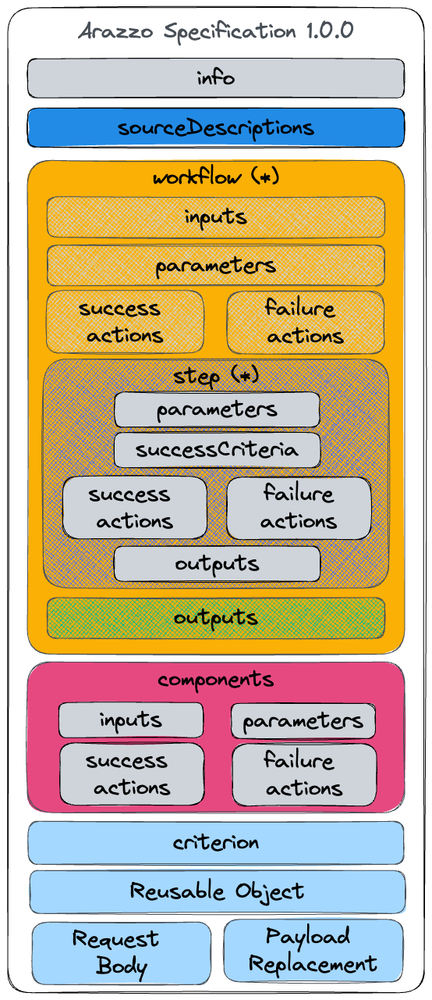
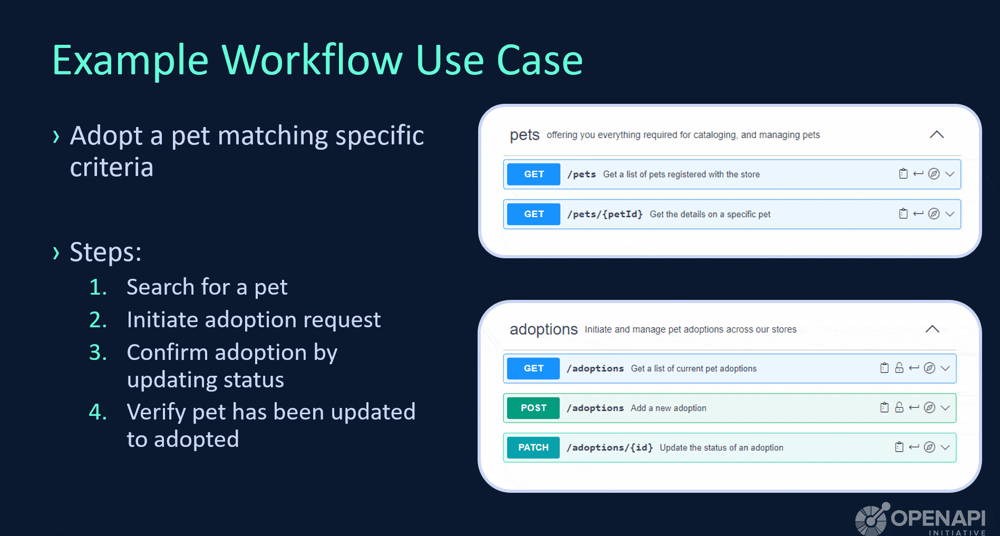
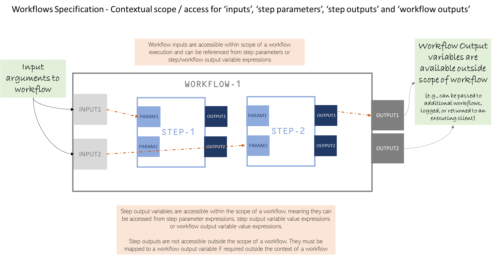

# The Arazzo Specification

The Arazzo Specification is a community-driven open specification within the [OpenAPI Initiative](https://www.openapis.org/), a Linux Foundation Collaborative Project.

The Arazzo Specification defines a standard, programming language-agnostic mechanism to express sequences of calls and articulate the dependencies between them to achieve a particular outcome, or set of outcomes, when dealing with API descriptions (such as OpenAPI descriptions). 

The Arazzo Specification can articulate these workflows in a deterministic human-readable and machine-readable manner, thus improving provider and consumer experiences when working with APIs. Similar to what OpenAPI has done for describing HTTP interfaces, the Arazzo Specification enables the ability to articulate the functional use cases offered by an API (or group of APIs) thus removing the guesswork for both human and machine consumers.

Use cases for machine-readable API workflow definition documents include, but are not limited to:
- interactive _living_ workflow documentation
- automated documentation generation (e.g. Developer Portal documentation)
- code and SDK generation driven by functional use cases
- automation of test cases
- automated regulatory compliance checks
- deterministic API invocation by AI-based LLMs

The Arazzo Specification does not mandate a specific development process such as _design-first_ or _code-first_. It does facilitate either technique by establishing clear workflow interactions with HTTP APIs described using the OpenAPI Specification.

This GitHub project is the starting point for Arazzo. Here you will find the information you need about the Arazzo Specification, simple examples of what it looks like, and some general information regarding the project.

## Current Version - 1.0.0

The current version of the Arazzo Specification is [Arazzo Specification 1.0.0](./versions/1.0.0.md).

## See Arazzo in Action

If you just want to see it work, check out the [list of current examples](./examples/1.0.0/).

## Getting Involved

The OpenAPI Initiative encourages participation from individuals and companies alike. If you want to participate in the evolution of the Arazzo Specification, check out the channels below.

- [Bi-weekly Call](https://github.com/OAI/Arazzo-Specification/discussions/5) - Wednesdays at 09:00 AM PDT
- [Discussions](https://github.com/OAI/Arazzo-Specification/discussions) - Use the GitHub discussions to ask questions, provide opinions and engage with the group
- [Issues](https://github.com/OAI/Arazzo-Specification/issues) - Feel free to submit a Github issue with any question or comment about the working group
- Slack - if you have access to the OpenAPI slack workspace, then join the `sig-workflows` channel. If you do not have access, you're welcome to join by clicking [here](https://communityinviter.com/apps/open-api/openapi)

## Licensing

See: License [Apache-2.0](https://github.com/OAI/Arazzo-Specification/blob/main/LICENSE)
