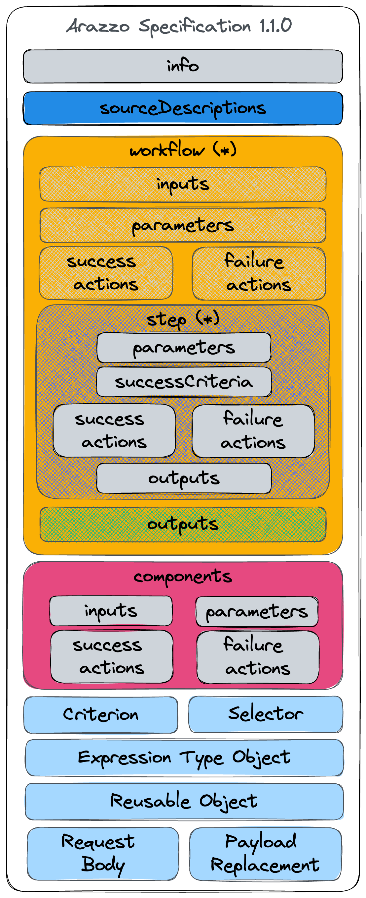
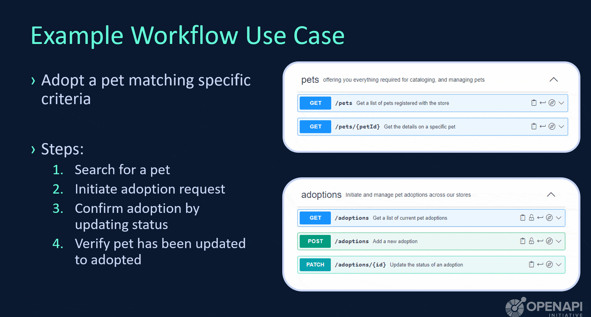
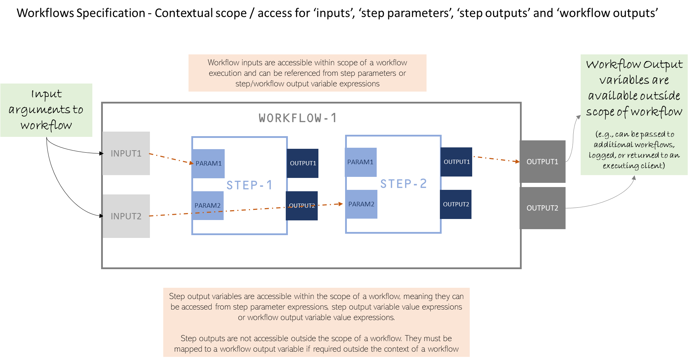

# The Arazzo Specification

The Arazzo Specification is a community-driven open specification within the [OpenAPI Initiative](https://www.openapis.org/), a Linux Foundation Collaborative Project.

The Arazzo Specification defines a standard, programming language-agnostic mechanism to express sequences of calls and articulate the dependencies between them to achieve a particular outcome, or set of outcomes, when dealing with API descriptions (such as OpenAPI and AsyncAPI descriptions).

The Arazzo Specification can articulate these workflows in a deterministic human-readable and machine-readable manner, thus improving provider and consumer experiences when working with APIs. Similar to what OpenAPI has done for describing HTTP interfaces, the Arazzo Specification enables the ability to articulate the functional use cases offered by an API (or group of APIs) thus removing the guesswork for both human and machine consumers.

Use cases for machine-readable API workflow definition documents include, but are not limited to:

- interactive _living_ workflow documentation
- automated documentation generation (e.g. Developer Portal documentation)
- code and SDK generation driven by functional use cases
- automation of test cases
- automated regulatory compliance checks
- deterministic API invocation by AI-based LLMs

The Arazzo Specification does not mandate a specific development process such as _design-first_ or _code-first_. It does facilitate either technique by establishing clear workflow interactions with HTTP APIs described using the OpenAPI Specification.

This GitHub project is the starting point for Arazzo. Here you will find the information you need about the Arazzo Specification, simple examples of what it looks like, and some general information regarding the project.

## Current Version - 1.1.0

The latest version of the Arazzo Specification can be viewed at [Arazzo Specification - latest](https://spec.openapis.org/arazzo/latest.html).

## Tooling

The Arazzo ecosystem is growing with various tools to help you work with Arazzo descriptions:

### Editors, Design Tools, and Renderers

- **[Arazzo Editor (from Jentic)](https://jentic.com/arazzo-editor)** - Build and edit Arazzo workflows with form-based editing and real-time diagrammatic representation.
- **[Arazzo Editor (from Symplr)](https://arazzo-editor.symplr.io/)** - A tool that lets you visualize, execute & publish Arazzo workflows
- **[Arazzo UI](https://arazzo-ui.jentic.com/)** - Visualize Arazzo workflows as interactive documentation with diagram and documentation views.
- **[API Flows Studio](https://github.com/API-Flows/api-flows-studio)** - A web application that loads and displays an Arazzo Workflow Document.
- **[ApiTapVia](https://github.com/lornajane/apitapviz)** - Simple visualisation of OpenAPI Arazzo files as Markdown or mermaidjs.

### Generators

- **[Arazzo Generator (by @jentic)](https://github.com/jentic/arazzo-engine/tree/main/generator)** - A tool for analyzing OpenAPI specifications and generating meaningful Arazzo workflows by identifying logical API sequences and patterns.
- **[Arazzo Generator (by @JaredCE)](https://github.com/JaredCE/Arazzo-Generator)** - Generate Arazzo Workflows from your OpenAPI Documents.

### Validation and Linting

- **[Arazzo Validator](https://github.com/jentic/jentic-arazzo-tools/tree/main/packages/jentic-arazzo-validator)** - A validator and linter for Arazzo Specification documents. It performs JSON Schema validation, semantic validation, and semantic linting.
- **[Redocly CLI](https://github.com/Redocly/redocly-cli)** - An all-in-one API documentation utility for working with OpenAPI, AsyncAPI, and Arazzo.
- **[Spectral](https://stoplight.io/spectral)** - Flexible OpenAPI/AsyncAPI/Arazzo linter for API governance and style guides.
- **[Speakeasy OpenAPI](https://github.com/speakeasy-api/openapi)** - OSS packages and CLI tools for validation, bundling, and working with Arazzo, OpenAPI, and Overlay documents.

### Parsers and Resolvers

- **[Arazzo Parser](https://github.com/jentic/jentic-arazzo-tools/tree/main/packages/jentic-arazzo-parser)** - TypeScript/JavaScript parser for Arazzo 1.0.0 and 1.0.1 documents.
- **[Arazzo Resolver](https://github.com/jentic/jentic-arazzo-tools/tree/main/packages/jentic-arazzo-resolver)** - TypeScript/JavaScript resolver and dereferencer for Arazzo and OpenAPI documents.
- **[Arazzo Runtime Expression](https://github.com/swaggerexpert/arazzo-runtime-expression)** - Arazzo Runtime Expressions parser, validator and extractor.
- **[Itarazzo](https://github.com/leidenheit/itarazzo-library)** - Library to parse, validate and execute an Arazzo specification.

### Workflow Execution and Testing

- **[arazzo-cli](https://strefethen.github.io/arazzo-cli/)** - Standalone Arazzo 1.0 workflow executor with runtime engine, debugger, and MCP server for AI agent integration.
- **[Arazzo Runner](https://github.com/jentic/arazzo-engine/tree/main/runner)** - A workflow execution engine that processes and executes API workflows defined in the Arazzo format and individual API calls defined in OpenAPI specifications.
- **[Respect CLI](https://redocly.com/respect-cli)** - A tool to run OpenAPI Arazzo workflows, identify gaps in schemas, status codes, and content types, and evaluate success criteria—all in one simple command
- **[Specmatic](https://specmatic.io/)** - Simplified Arazzo Authoring & API Workflow Testing.

### Converters

- **[arazzo2openapi](https://frankkilcommins.github.io/arazzo2openapi)** - Convert Arazzo workflow documents into OpenAPI documents with intelligent type inference.
- **[pyarazzo](https://github.com/b-lab-io/pyarazzo)** - A CLI to transform Arazzo specification into some other formats (e.g., Markdown, PlantUML).

For another comprehensive and up-to-date listing of Arazzo tooling, visit [openapi.tools](https://openapi.tools/?arazzo=true) and filter by Arazzo support.

## See Arazzo in Action

If you just want to see it work, check out the [list of current examples](./examples/1.0.0/).

## Getting Involved

The OpenAPI Initiative encourages participation from individuals and companies alike. If you want to participate in the evolution of the Arazzo Specification, check out the channels below.

- [Bi-weekly Call](https://github.com/OAI/Arazzo-Specification/discussions/5) - Wednesdays at 09:00 AM PDT
- [Discussions](https://github.com/OAI/Arazzo-Specification/discussions) - Use the GitHub discussions to ask questions, provide opinions and engage with the group
- [Issues](https://github.com/OAI/Arazzo-Specification/issues) - Feel free to submit a Github issue with any question or comment about the working group
- Slack - if you have access to the OpenAPI slack workspace, then join the `arazzo` channel. If you do not have access, [you're welcome to join](https://communityinviter.com/apps/open-api/openapi)

## Licensing

See: License [Apache-2.0](https://github.com/OAI/Arazzo-Specification/blob/main/LICENSE)
