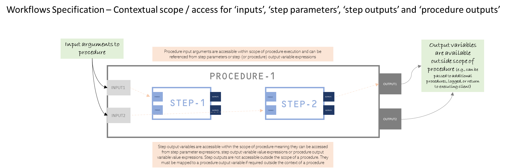

# Workflows Specification

## Version 1.0.0-prerelease

> _Work is progressing well on this specification. Formally, we are still in a **prerelease** status_

The key words "MUST", "MUST NOT", "REQUIRED", "SHALL", "SHALL NOT", "SHOULD", "SHOULD NOT", "RECOMMENDED", "NOT RECOMMENDED", "MAY", and "OPTIONAL" in this document are to be interpreted as described in [BCP 14](https://tools.ietf.org/html/bcp14) [RFC2119](https://tools.ietf.org/html/rfc2119) [RFC8174](https://tools.ietf.org/html/rfc8174) when, and only when, they appear in all capitals, as shown here.

This document is licensed under [The Apache License, Version 2.0](https://www.apache.org/licenses/LICENSE-2.0.html).

## Introduction

Being able to express specific sequences of calls and articulate the dependencies between them to achieve a particular goal is desirable in the context of API descriptions. The aim of the Workflows Specification is to provide a mechanism that can define sequences of calls and their dependencies to be expressed in the context of delivering a particular outcome or set of outcomes when dealing with API descriptions (such as OpenAPI descriptions).

The Workflows Specification can articulate these workflows in a human-readable and machine-readable manner, thus improving the capability of API specifications to tell the story of the API in a manner that can improve the consuming developer experience.

<!-- TOC depthFrom:1 depthTo:3 withLinks:1 updateOnSave:1 orderedList:0 -->
## Table of Contents

- [Workflows Specification](#workflows-specification)
  - [Version 1.0.0-prerelease](#version-100-prerelease)
  - [Introduction](#introduction)
  - [Table of Contents](#table-of-contents)
  - [Definitions](#definitions)
      - [Workflows Description](#workflows-description)
  - [Specification](#specification)
    - [Versions](#versions)
    - [Format](#format)
    - [Workflows Description Structure](#workflows-description-structure)
    - [Data Types](#data-types)
    - [Relative References in URLs](#relative-references-in-urls)
    - [Schema](#schema)
      - [Workflows Specification Object](#workflows-specification-object)
        - [Fixed Fields](#fixed-fields)
        - [Workflows Specification Object Example](#workflows-specification-object-example)
      - [Info Object](#info-object)
        - [Fixed Fields](#fixed-fields-1)
        - [Info Object Example](#info-object-example)
      - [Source Description Object](#source-description-object)
        - [Fixed Fields](#fixed-fields-2)
        - [Source Description Object Example](#source-description-object-example)
      - [Workflow Object](#workflow-object)
        - [Fixed Fields](#fixed-fields-3)
        - [Workflow Object Example](#workflow-object-example)
      - [Step Object](#step-object)
        - [Fixed Fields](#fixed-fields-4)
        - [Step Object Example](#step-object-example)
      - [Parameter Object](#parameter-object)
        - [Fixed Fields](#fixed-fields-5)
        - [Parameter Object Example](#parameter-object-example)
      - [Success Action Object](#success-action-object)
        - [Fixed Fields](#fixed-fields-6)
        - [Success Action Object Example](#success-action-object-example)
      - [Failure Action Object](#failure-action-object)
        - [Fixed Fields](#fixed-fields-7)
        - [Failure Action Object Example](#failure-action-object-example)
      - [Components Object](#components-object)
        - [Fixed Fields](#fixed-fields-8)
        - [Components Object Example](#components-object-example)
      - [Reference Object](#reference-object)
        - [Fixed Fields](#fixed-fields-9)
        - [Reference Object Example](#reference-object-example)      
      - [Criterion Object](#criterion-object)
        - [Fixed Fields](#fixed-fields-10)
        - [Criterion Object Example](#criterion-object-example)          
    - [Runtime Expressions](#runtime-expressions)
    - [Specification Extensions](#specification-extensions)
    - [Security Considerations](#security-considerations)
    - [IANA Considerations](#iana-considerations)
  - [Appendix A: Revision History](#appendix-a-revision-history)
  - [Appendix B: Contextual Scope Overview](#appendix-b-contextual-scope--access-for-inputs-and-outputs)
<!-- /TOC -->

## Definitions

### Workflows Description
A self-contained document (or set of documents) which defines or describes API workflows (specific sequence of calls to achieve a particular goal in the context of an API definition). A Workflows Description (WD) uses and conforms to the Workflows Specification, and `MUST` contain a valid Workflows Specification version field (`workflowsSpec`), an [Info](#info-object) field, a `sourceDescriptions` field with at least one defined [Source](#source-description-object), and there `MUST` be at least one [Workflow](#workflow-object) defined in the `workflows` fixed field.

## Specification

### Versions

The Workflows Specification is versioned using a `major`.`minor`.`patch` versioning scheme. The `major`.`minor` portion of the version string (for example 1.0) SHALL designate the Workflows feature set. `.patch` versions address errors in, or provide clarifications to, this document, not the feature set. The patch version SHOULD NOT be considered by tooling, making no distinction between 1.0.0 and 1.0.1 for example.

### Format

A Workflows Description that conforms to the Workflows Specification is itself a JSON object, which may be represented either in JSON or YAML format.

All field names in the specification are **case sensitive**.
This includes all fields that are used as keys in a map, except where explicitly noted that keys are **case insensitive**.

In order to preserve the ability to round-trip between YAML and JSON formats, YAML version [1.2](https://yaml.org/spec/1.2/spec.html) is RECOMMENDED along with some additional constraints:

- Tags MUST be limited to those allowed by the [JSON Schema ruleset](https://yaml.org/spec/1.2/spec.html#id2803231).
- Keys used in YAML maps MUST be limited to a scalar string, as defined by the [YAML Failsafe schema ruleset](https://yaml.org/spec/1.2/spec.html#id2802346).

### Workflows Description Structure

It is RECOMMENDED that the entry Workflows document be named: `workflows.json` or `workflows.yaml`.

A Workflows Description MAY be made up of a single document or be divided into multiple, connected parts at the discretion of the author. In the latter case, [Reference Objects](#reference-object) are used.  In a multi-document description, the document containing the [Workflows Specification Object](#workflows-specification-object) is known as the **entry Workflows document**.

### Data Types

Data types in the Workflows Specification are based on the types supported by the [JSON Schema Specification Draft 2020-12](https://tools.ietf.org/html/draft-bhutton-json-schema-00#section-4.2.1). Note that integer as a type is also supported and is defined as a JSON number without a fraction or exponent part.

As defined by the [JSON Schema Validation vocabulary](https://tools.ietf.org/html/draft-bhutton-json-schema-validation-00#section-7), data types can have an optional modifier property: `format`. Workflows additionally supports the formats (similar to the OpenAPI specification) to provide fine detail for primitive data types.

The formats defined are:
[`type`](#data-types) | `format` | Comments
------ | -------- | --------
`integer` | `int32` | signed 32 bits
`integer` | `int64` | signed 64 bits (a.k.a long)
`number` | `float` | |
`number` | `double` | |
`string` | `password` | A hint to UIs to obscure input.


### Relative References in URLs

Unless specified otherwise, all properties that are URLs MAY be relative references as defined by [RFC3986](https://tools.ietf.org/html/rfc3986#section-4.2).
Unless specified otherwise, relative references are resolved using the URL of the referring document.

### Schema

In the following description, if a field is not explicitly **REQUIRED** or described with a MUST or SHALL, it can be considered OPTIONAL.

#### Workflows Specification Object

This is the root object of the [Workflows Description](#workflows-description).

##### Fixed Fields

Field Name | Type | Description
---|:---:|---
<a name="workflowsVersion"></a>workflowsSpec | `string` | **REQUIRED**. This string MUST be the [version number](#versions) of the Workflows Specification that the Workflows Description uses. The `workflowsSpec` field MUST be used by tooling to interpret the Workflows Description.
<a name="workflowsInfo"></a>info | [Info Object](#info-object) | **REQUIRED**. Provides metadata about the Workflows. The metadata MAY be used by tooling as required.
<a name="workflowsSources"></a>sourceDescriptions | [[Source Description Object](#source-description-object)] | **REQUIRED**. A list of source descriptions (such as an OpenAPI description) this workflow SHALL apply to. The list MUST have at least one entry.
<a name="workflows"></a>workflows | [[Workflow Object](#workflow-object)] | **REQUIRED**. A list of workflows. The list MUST have at least one entry.
<a name="components"></a>components | [Components Object](#components-object) | An element to hold various schemas for the Workflows Description.

This object MAY be extended with [Specification Extensions](#specification-extensions).

##### Workflows Specification Object Example

```yaml
workflowsSpec: 1.0.0-prerelease
info:
  title: A pet purchasing workflow
  summary: This workflow showcases how to purchase a pet through a sequence of API calls
  description: |
      This workflow walks you through the steps of `searching` for, `selecting`, and `purchasing` an available pet.
  version: 1.0.1
sourceDescriptions:
- name: petStoreDescription
  url: https://github.com/swagger-api/swagger-petstore/blob/master/src/main/resources/openapi.yaml
  type: openapi

workflows:
- workflowId: loginUserAndRetrievePet
  summary: Login User and then retrieve pets
  description: This workflow lays out the steps to login a user and then retrieve pets
  inputs:
      type: object
      properties:
          username:
              type: string
          password:
              type: string
  steps:
  - stepId: loginStep
    description: This step demonstrates the user login step
    operationId: loginUser
    parameters:
      # parameters to inject into the loginUser operation (parameter name must be resolvable at the referenced operation and the value is determined using {expression} syntax)
      - name: username
        in: query
        value: $inputs.username
      - name: password
        in: query
        value: $inputs.password
    successCriteria:
      # assertions to determine step was successful
      - condition: $statusCode == 200
    outputs:
      # outputs from this step
      tokenExpires: $response.header.X-Expires-After
      rateLimit: $response.header.X-Rate-Limit
      sessionToken: $response.body
  - stepId: getPetStep
    description: retrieve a pet by status from the GET pets endpoint
    operationRef: https://github.com/swagger-api/swagger-petstore/blob/master/src/main/resources/openapi.yaml#/paths/~1pet~1findByStatus/get
    dependsOn: loginStep
    parameters:
      - name: status
        in: query
        value: 'available'
      - name: Authorization
        in: header
        value: $steps.loginUser.outputs.sessionToken
    successCriteria:
      - condition: $statusCode == 200
    outputs:
      # outputs from this step
      availablePets: $response.body
  outputs:
      available: $steps.getPetStep.availablePets
```

#### Info Object

The object provides metadata about the API Workflows defined in this document.
The metadata MAY be used by the clients if needed.

##### Fixed Fields

Field Name | Type | Description
---|:---:|---
<a name="infoTitle"></a>title | `string` | **REQUIRED**. A human readable title of the Workflows Description.
<a name="infoSummary"></a>summary | `string` | A short summary of the Workflows Description.
<a name="infoDescription"></a>description | `string` | A description of the purpose of the workflows defined. [CommonMark syntax](https://spec.commonmark.org/) MAY be used for rich text representation.
<a name="infoVersion"></a>version | `string` | **REQUIRED**. The version identifier of the Workflows document (which is distinct from the [Workflows Specification version](#versions).


This object MAY be extended with [Specification Extensions](#specification-extensions).

##### Info Object Example

```yaml
title: A pet purchasing workflow
summary: This workflow showcases how to purchase a pet through a sequence of API calls
description: |
    This workflow walks you through the steps of searching for, selecting, and purchasing an available pet.
version: 1.0.1
```

#### Source Description Object

Describes a source description (such as an OpenAPI description) that will be referenced by one or more workflows described within a Workflows Description.

An object storing a map between named description keys and location URLs to the source descriptions (such as an OpenAPI description) this workflow SHALL apply to. Each source location `string` MUST be in the form of a [URL](https://url.spec.whatwg.org/). MAY be defined using relative references as defined by [RFC3986](https://spec.openapis.org/oas/latest.html#bib-RFC3986).

##### Fixed Fields

Field Name | Type | Description
---|:---:|---
<a name="sourceName"></a>name | `string` | **REQUIRED**. A unique name for the source description. Tools and libraries MAY use the `name` to uniquely identify a source description, therefore, it is RECOMMENDED to follow common programming naming conventions. SHOULD conform to the regular expression `[A-Za-z0-9_\-]+`.
<a name="sourceURL"></a>url | `string` | **REQUIRED**. A URL to a source description to be used by a Workflow. MUST be in the form of a [URL](https://url.spec.whatwg.org/). MAY be defined using relative references as defined by [RFC3986](https://spec.openapis.org/oas/latest.html#bib-RFC3986).
<a name="infoType"></a>type | `string` | The type of source description. Possible values are `"openapi"` or `"workflowsSpec"`.


This object MAY be extended with [Specification Extensions](#specification-extensions).

##### Source Description Object Example

```yaml
name: petStoreDescription
url: https://github.com/swagger-api/swagger-petstore/blob/master/src/main/resources/openapi.yaml
type: openapi
```

#### Workflow Object

Describes the steps to be taken across one or more APIs to achieve an objective. The workflow object MAY define inputs needed in order to execute workflow steps, where the defined steps represent a call to an API operation or another workflow, and a set of outputs.

##### Fixed Fields

Field Name | Type | Description
---|:---:|---
<a name="workflowId"></a>workflowId | `string` | **REQUIRED**. Unique string to represent the workflow. The id MUST be unique amongst all workflows describe in the Workflows Description. The `workflowId` value is **case-sensitive**. Tools and libraries MAY use the `workflowId` to uniquely identify a workflow, therefore, it is RECOMMENDED to follow common programming naming conventions. SHOULD conform to the regular expression `[A-Za-z0-9_\-]+`.
<a name="workflowSummary"></a>summary | `string` | A summary of the purpose or objective of the workflow.
<a name="workflowDescription"></a>description | `string` | A description of the workflow. [CommonMark syntax](https://spec.commonmark.org/) MAY be used for rich text representation.
<a name="workflowInputs"></a>inputs | `JSON Schema` | A JSON Schema 2020-12 object representing the input parameters used by this workflow.
<a name="workflowSteps"></a>steps | [[Step Object](#step-object)] | **REQUIRED**. An ordered list of steps where each step represents a call to an API operation or to another workflow.
<a name="workflowOutputs"></a>outputs | Map[`string`, {expression}] |  A map between a friendly name and a dynamic output value. The name MUST use keys that match the regular expression: `^[a-zA-Z0-9\.\-_]+$`.

This object MAY be extended with [Specification Extensions](#specification-extensions).

##### Workflow Object Example

```yaml
workflowId: loginUser
summary: Login User
description: This workflow lays out the steps to login a user
inputs:
    type: object
    properties:
        username:
            type: string
        password:
            type: string
steps:
  - stepId: loginStep
    description: This step demonstrates the user login step
    operationId: loginUser
    parameters:
      # parameters to inject into the loginUser operation (parameter name must be resolvable at the referenced operation and the value is determined using {expression} syntax)
      - name: username
        in: query
        value: $inputs.username
      - name: password
        in: query
        value: $inputs.password
    successCriteria:
        # assertions to determine step was successful 
        - condition: $statusCode == 200
    outputs:
        # outputs from this step
        tokenExpires: $response.header.X-Expires-After
        rateLimit: $response.header.X-Rate-Limit
outputs:
    tokenExpires: $steps.loginStep.outputs.tokenExpires
```

#### Step Object

Describes a single workflow step which MAY be a call to an API operation ([OpenAPI Operation Object](https://spec.openapis.org/oas/latest.html#operation-object) or another [Workflow Object](#workflow-object).

##### Fixed Fields

Field Name | Type | Description
---|:---:|---
<a name="stepDescription"></a>description | `string` | A description of the step. [CommonMark syntax](https://spec.commonmark.org/) MAY be used for rich text representation.
<a name="stepId"></a>stepId | `string` | **REQUIRED**. Unique string to represent the step. The `stepId` MUST be unique amongst all steps described in the workflow. The `stepId` value is **case-sensitive**. Tools and libraries MAY use the `stepId` to uniquely identify a workflow step, therefore, it is RECOMMENDED to follow common programming naming conventions. SHOULD conform to the regular expression `[A-Za-z0-9_\-]+`.
<a name="stepOperationId"></a>operationId | `string` | The name of an existing, resolvable operation, as defined with a unique `operationId` and existing within one of the `sourceDescriptions`. The referenced operation will be invoked by this workflow step. If multiple (non `workflowsSpec` type) `sourceDescriptions` are defined, then the `operationId` MUST be specified using a [runtime expression](#runtime-expressions) (e.g., `$sourceDescriptions.<name>.<operationId>`) to avoid ambiguity or potential clashes. This field is mutually exclusive of the `operationRef` and `workflowId` fields respectively.
<a name="stepOperationRef"></a>operationRef | `string` | A relative or absolute URI reference to an OAS operation. This field is mutually exclusive of the `operationId` and `workflowId` fields respectively. A complete [URI Template](https://www.rfc-editor.org/rfc/rfc6570) SHOULD be used. The operation being referenced MUST be described within one of the `source` descriptions.
<a name="stepWorkflowId"></a>workflowId | `string` | The [workflowId](#fixed-fields-2) referencing an existing workflow within the Workflows Description. If multiple `workflowsSpec` type `sourceDescriptions` are defined, then the `workflowId` MUST be specified using a [runtime expression](#runtime-expressions) (e.g., `$sourceDescriptions.<name>.<workflowId>`) to avoid ambiguity or potential clashes. The field is mutually exclusive of the `operationId` and `operationRef` fields respectively.
<a name="stepParameters"></a>parameters | [[Parameter Object](#parameter-object) \| [Reference Object](#reference-object)] | A list of parameters to pass to an operation or workflow as referenced by `operationId`, `operationRef`, or `workflowId`. If a Reference Object is provided, it MUST link to parameters defined in [components/parameters](#components-object).
<a name="dependsOn"></a>dependsOn | [`string`] | A list of steps that MUST be completed before this step can be processed. This helps to ensure workflow steps are executed in the correct order and that dependent steps are not processed in parallel. The values provided MUST be the be the `stepId` which uniquely references a step.
<a name="stepSuccessCriteria"></a>successCriteria | [[Criterion Object](#criterion-object)] | A list of assertions to determine the success of the step. Each assertion is described using a [Criterion Object](#criterion-object). All assertions `MUST` be satisfied for the step to be deemed successful.
<a name="stepOnSuccess"></a>onSuccess | [[Success Action Object](#success-action-object)] | An array of success action objects that specify what to do upon step success. If omitted, the next sequential step shall be executed as the default behavior. If multiple success actions have similar `criteria`, the first sequential action matching the criteria SHALL be the action executed.
<a name="stepOnFailure"></a>onFailure | [[Failure Action Object](#failure-action-object)] | An array of failure action objects that specify what to do upon step failure. If omitted, the default behavior is to break and return. If multiple failure actions have similar `criteria`, the first sequential action matching the criteria SHALL be the action executed.
<a name="stepOutputs"></a>outputs | Map[`string`, {expression}] |  A map between a friendly name and a dynamic output value defined using a [runtime expression](#runtime-expressions). The name MUST use keys that match the regular expression: `^[a-zA-Z0-9\.\-_]+$`.

This object MAY be extended with [Specification Extensions](#specification-extensions).

##### Step Object Example

**Single step**

```yaml
stepId: loginStep
description: This step demonstrates the user login step
operationId: loginUser
parameters:
    # parameters to inject into the loginUser operation (parameter name must be resolvable at the referenced operation and the value is determined using {expression} syntax)
    - name: username
      in: query
      value: $inputs.username
    - name: password
      in: query
      value: $inputs.password
successCriteria:
    # assertions to determine step was successful
    - condition: $statusCode == 200
outputs:
    # outputs from this step
    tokenExpires: $response.header.X-Expires-After
    rateLimit: $response.header.X-Rate-Limit
```

**Multiple steps**

```yaml
steps:
  - stepId: loginStep
    description: This step demonstrates the user login step
    operationId: loginUser
    parameters:
        # parameters to inject into the loginUser operation (parameter name must be resolvable at the referenced operation and the value is determined using {expression} syntax)
      - name: username
        in: query
        value: $inputs.username
      - name: password
        in: query
        value: $inputs.password
    successCriteria:
        # assertions to determine step was successful
      - condition: $statusCode == 200
    outputs:
        # outputs from this step
        tokenExpires: $response.header.X-Expires-After
        rateLimit: $response.header.X-Rate-Limit
        sessionToken: $response.body
  - stepId: getPetStep
    description: retrieve a pet by status from the GET pets endpoint
    operationRef: https://github.com/swagger-api/swagger-petstore/blob/master/src/main/resources/openapi.yaml#/paths/~1pet~1findByStatus/get
    parameters:
      - name: status
        in: query
        value: 'available'
      - name: Authorization
        in: header
        value: $steps.loginUser.outputs.sessionToken
    successCriteria:
      - condition: $statusCode == 200
    outputs:
        # outputs from this step
        availablePets: $response.body
```

#### Parameter Object

Describes a single step parameter. A unique parameter is defined by the combination of a `name` and `in` fields. There are five possible locations specified by the `in` field:
  - path - Used together with OpenAPI style [Path Templating](https://github.com/OAI/OpenAPI-Specification/blob/main/versions/3.1.0.md#pathTemplating), where the parameter value is actually part of the operation's URL. This does not include the host or base path of the API. For example, in /items/{itemId}, the path parameter is itemId.
  - query - Parameters that are appended to the URL. For example, in `/items?id=###`, the query parameter is `id`.
  - header - Custom headers that are expected as part of the request. Note that [RFC7230](https://tools.ietf.org/html/rfc7230#page-22) states header names are case insensitive.
  - cookie - Used to pass a specific cookie value to the source API.
  - body - The request, message or form body to be sent to the referenced operation.

##### Fixed Fields
Field Name | Type | Description
---|:---:|---
<a name="parameterName"></a> name | `string` | **REQUIRED**. The name of the parameter. Parameter names are _case sensitive_.
<a name="parameterIn"></a> in | `string` | The name location of the parameter. Possible values are `"path"`, `"query"`, `"header"`, `"cookie"`, or `"body"`.  When the step in context specifies a `workflowId`, then all parameters map to workflow inputs. In all other scenarios (e.g., a step specifies an `operationId`), the `in` field MUST be specified.
<a name="parameterStyle"></a> style | `string` | Describes how the parameter value will be serialized depending on the location of parameter value. This fixed field is predominately used to express how a _request body_ is to be serialized. For example, when request data (`in` with value `"body"`) is to be serialized as `x-www-form-urlencoded`, the style SHOULD be `"form"`. `in` parameters with values of `"query"`, `"header"`, or `"cookie"` MUST derive their style from the referenced `sourceDescriptions` operation when applicable.
<a name="parameterTarget"></a> target | `string` | A [JSON Pointer](https://tools.ietf.org/html/rfc6901) identifying locations to inject the value. Useful for targeting specific request body parts.
<a name="parameterValue"></a> value | Any \| {expression} | **REQUIRED**. The value to pass in the parameter. The value can be a constant or an [expression](#runtime-expressions) to be evaluated and passed to the referenced operation or workflow.

This object MAY be extended with [Specification Extensions](#specification-extensions).

##### Parameter Object Example
**Query Example**

```yaml
- name: username
  in: query
  value: $inputs.username
```

**Encoded Body Example**

```yaml
- name: client_id
  in: body
  style: form
  value: $inputs.clientId
- name: grant_type
  in: body
  style: form
  value: authorization_code
- name: redirect_uri
  in: body
  style: form
  value: $inputs.redirectUri
- name: client_secret
  in: body
  style: form
  value: $inputs.clientSecret
- name: code
  in: body
  style: form
  value: $steps.browser-authorize.outputs.code
- name: scope
  in: body
  style: form
  value: $inputs.scope
```

#### Success Action Object

A single success action which describes an action to take upon success of a workflow step. There are two possible values for the `type` field.
  - end - The workflow ends, and context returns to the caller with applicable outputs
  - goto - A one-way transfer of workflow control to the specified label (either a `workflowId` or `stepId`)

##### Fixed Fields
Field Name | Type | Description
---|:---:|---
<a name="successActionType"></a> type | `string` | **REQUIRED**. The type of action to take. Possible values are `"end"` or `"goto"`.
<a name="successWorkflowId"></a> workflowId | `string` | The [workflowId](#fixed-fields-2) referencing an existing workflow within the Workflows Description to transfer to upon success of the step. This field is only relevant when the `type` field value is `"goto"`. If multiple `workflowsSpec` type `sourceDescriptions` are defined, then the `workflowId` MUST be specified using a [runtime expression](#runtime-expressions) (e.g., `$sourceDescriptions.<name>.<workflowId>`) to avoid ambiguity or potential clashes.  This field is mutually exclusive to `stepId`.
<a name="successStepId"></a> stepId | `string` | The `stepId` to transfer to upon success of the step. This field is only relevant when the `type` field value is `"goto"`. The referenced `stepId` MUST be within the current workflow. This field is mutually exclusive to `workflowId`.
<a name="successCriteria"></a> criteria | [[Criterion Object](#criterion-object)] | A list of assertions to determine if this action SHALL be executed. Each assertion is described using a [Criterion Object](#criterion-object). All criteria assertions `MUST` be satisfied for the action to be executed.


This object MAY be extended with [Specification Extensions](#specification-extensions).

##### Success Action Object Example

```yaml
type: goto
stepId: joinWaitingListStep
criteria:
    # assertions to determine if this success action should be executed
    - context: $response.body
      condition: $.Pets.length() > 0
      type: JSONPath
```

#### Failure Action Object

A single failure action which describes an action to take upon failure of a workflow step. There are three possible values for the `type` field.
  - end - The workflow ends, and context returns to the caller with applicable outputs
  - retry - The current step will be retried. The retry will be constrained by the `retryAfter` and `retryLimit` fields. If a `stepId` or `workflowId` are specified, then the reference is executed and the context is returned, after which the current step is retried.
  - goto - A one-way transfer of workflow control to the specified label (either a `workflowId` or `stepId`)

##### Fixed Fields
Field Name | Type | Description
---|:---:|---
<a name="failureActionType"></a> type | `string` | **REQUIRED**. The type of action to take. Possible values are `"end"`, `"retry"`, or `"goto"`.
<a name="failureWorkflowId"></a> workflowId | `string` | The [workflowId](#fixed-fields-2) referencing an existing workflow within the Workflows Description to transfer to upon failure of the step. This field is only relevant when the `type` field value is `"goto"` or `"retry"`. If multiple `workflowsSpec` type `sourceDescriptions` are defined, then the `workflowId` MUST be specified using a [runtime expression](#runtime-expressions) (e.g., `$sourceDescriptions.<name>.<workflowId>`) to avoid ambiguity or potential clashes.  This field is mutually exclusive to `stepId`. When used with `"retry"`, context transfers back upon completion of the specified workflow.
<a name="failureStepId"></a> stepId | `string` | The `stepId` to transfer to upon failure of the step. This field is only relevant when the `type` field value is `"goto"` or `"retry"`. The referenced `stepId` MUST be within the current workflow. This field is mutually exclusive to `workflowId`. When used with `"retry"`, context transfers back upon completion of the specified step.
<a name="failureRetryAfter"></a> retryAfter | `number` | A non-negative decimal indicating the seconds to delay after the step failure before another attempt SHALL be made. **Note:** if an HTTP [Retry-After](https://www.rfc-editor.org/rfc/rfc9110.html#name-retry-after) response header was returned to a step from a targeted operation, then it SHOULD overrule this particular field value. This field only applies when the `type` field value is `"retry"` or `"function"`.
<a name="failureRetryLimit"></a> retryLimit | `integer` | A non-negative integer indicating how many attempts to retry the step MAY be attempted before failing the overall step. If not specified then a single retry SHALL be attempted. This field only applies when the `type` field value is `"retry"`. The `retryLimit` MUST be exhausted prior to executing subsequent failure actions.
<a name="failureCriteria"></a> criteria | [[Criterion Object](#criterion-object)] | A list of assertions to determine if this action SHALL be executed. Each assertion is described using a [Criterion Object](#criterion-object).


This object MAY be extended with [Specification Extensions](#specification-extensions).

##### Failure Action Object Example

```yaml
type: retry
retryAfter: 1
retryLimit: 5
criteria:
    # assertions to determine if this action should be executed
    - condition: $statusCode == 503
```

#### Components Object

Holds a set of reusable objects for different aspects of the Workflows Specification. All objects defined within the components object will have no effect on the workflow unless they are explicitly referenced from properties outside the components object.

##### Fixed Fields

Field Name | Type | Description
---|:---|---
<a name="componentInputs"></a> inputs | Map[`string`, `JSON Schema`] | An object to hold reusable JSON Schema objects to be referenced from workflow inputs.
<a name="componentParameters"></a>parameters | Map[`string`, [Parameter Object](#parameter-object)] | An object to hold reusable Parameter Objects

This object MAY be extended with [Specification Extensions](#specificationExtensions).


All the fixed fields declared above are objects that MUST use keys that match the regular expression: `^[a-zA-Z0-9\.\-_]+$`. The key is used to refer to the input or parameter in other parts of the Workflow Description.

Field Name Examples:

```
User
User_1
User_Name
user-name
my.org.User
```

##### Components Object Example

```yaml
components:
  inputs:
    storeId:
      name: storeId
      in: header
      value: $inputs.x-store-id
  parameters:
    pagination:
      type: object
      properties:
        page:
          type: integer
          format: int32
        pageSize:
          type: integer
          format: int32
```

```json
"components": {
  "inputs": {
    "storeId": {
      "name": "storeId",
      "in": "header",
      "value": "$inputs.x-store-id"
    }
  },
  "parameters": {
    "pagination": {
      "type": "object",
      "properties": {
        "page": {
          "type": "integer",
          "format": "int32"
        },
        "pageSize": {
          "type": "integer",
          "format": "int32"
        }
      }
    }
  }
}
```

#### Reference Object

A simple object to allow referencing other components in the Workflows Description.

**Note -** This section is derived from the [OpenAPI Specification](https://github.com/OAI/OpenAPI-Specification/blob/main/versions/3.1.0.md#referenceObject), and is intended to be implemented in similar fashion.

The `$ref` string value contains a URI [RFC3986](https://tools.ietf.org/html/rfc3986), which identifies the location of the value being referenced.

See the rules for resolving [Relative References](https://github.com/OAI/OpenAPI-Specification/blob/main/versions/3.1.0.md#relativeReferencesURI).

##### Fixed Fields
Field Name | Type | Description
---|:---:|---
<a name="referenceRef"></a>$ref | `string` | **REQUIRED**. The reference identifier. This MUST be in the form of a URI.
<a name="referenceValue"></a>value | `string` | A value by default MUST override that of the referenced component. If the referenced object-type does not have a `value` field, then it has no effect.

This object cannot be extended with additional properties and any properties added SHALL be ignored.

##### Reference Object Example

```yaml
  $ref: "#/components/parameters/page"
  value: 1
```

```json
  {
    "$ref": "#/components/parameters/page",
    "value": 1
  }
```

#### Criterion Object

An object used to specify the context, conditions, and condition types that can be used to prove or satisfy assertions specified in [Step Object](#step-object) `successCriteria`, [Success Action Object](#success-action-object) `criteria`, and [Failure Action Object](#failure-action-object) `criteria`.

There are three flavors of conditions supported:
- simple - where basic literals, operators, and loose comparisons are used in combination with [Runtime Expressions](#runtime-expressions).
- regex - where a regex pattern is applied on the supplied context. The context is defined by a [Runtime Expression](#runtime-expressions).
- JSONPath - where a JSONPath expression is applied. The root node context is defined by a [Runtime Expression](#runtime-expressions).

##### Literals
As part of a condition expression, you can use `boolean`, `null`, `number`, or `string` data types.

Type | Literal value
---|---
`boolean` | `true` or `false`
`null` |  `null`
`number` | Any number format supported in [Data Types](#data-types)
`string` | Strings MUST use single quotes (') around the string. To use a literal single quote, escape the literal single quote using an additional single quote ('').

##### Operators
Operator | Description
---|---
`<`| Less than
`<=`| Less than or equal
`>`| Greater than
`>=`| Greater than or equal
`==`| Equal
`!=`| Not equal
`!`| Not
`&&`| And
`\|\|`| Or
`()`| Logical Grouping
`[]`| Index (0-based)
`.`| Property de-reference

String comparisons `MUST` be case insensitive.

##### Fixed Fields
Field Name | Type | Description
---|:---:|---
<a name="criterionContext"></a>context | `{expression}` | A [runtime expression](#runtime-expressions) used to set the context for the condition to be applied on. If `type` is specified, then the `context` MUST be provided (e.g. `$response.body` would set the context that a JSONPath query expression could be applied to).
<a name="criterionCondition"></a>condition | `string` | **REQUIRED**. The condition to apply. Conditions can be simple (e.g. `$statusCode == 200` which applies a operator on a value obtained from a runtime expression), or a regex, or a JSONPath expression. For regex and [JSONPath](https://datatracker.ietf.org/doc/draft-ietf-jsonpath-base/21/), the `type` and `context` MUST be specified.
<a name="criterionType"></a>type | `string` | The type of condition to be applied. If specified, the options allowed are `simple`, `regex` or `JSONPath`. If omitted, then the condition is assumed to be `simple`, which at most combines literals, operators and [Runtime Expressions](#runtime-expressions).


This object MAY be extended with [Specification Extensions](#specificationExtensions).

##### Criterion Object Example

**Simple Condition Example**

```yaml
- condition: $statusCode == 200
```

**Regex Condition Example**
```yaml
- context: $statusCode
  condition: '^200$'
  type: regex
```

**JSONPath Condition Example**
```yaml
- context: $response.body
  condition: $[?length(@.pets) > 0]
  type: JSONPath
```

### <a name="runtimeExpressions"></a>Runtime Expressions
A runtime expression allows values to be defined based on information that will be available within an HTTP message, an event message, and within objects serialized from the Workflows document such as [workflows](#workflow-object) or [steps](#step-object).

The runtime expression is defined by the following [ABNF](https://tools.ietf.org/html/rfc5234) syntax:

```abnf
      expression = ( "$url" / "$method" / "$statusCode" / "$request." source / "$response." source / "$message." source / "$inputs." name / "$outputs." name / "$steps." name / "$workflows." name / "$sourceDescriptions." name)
      source = ( header-reference / query-reference / path-reference / body-reference )
      header-reference = "header." token
      query-reference = "query." name
      path-reference = "path." name
      body-reference = "body" ["#" json-pointer ]
      json-pointer    = *( "/" reference-token )
      reference-token = *( unescaped / escaped )
      unescaped       = %x00-2E / %x30-7D / %x7F-10FFFF
         ; %x2F ('/') and %x7E ('~') are excluded from 'unescaped'
      escaped         = "~" ( "0" / "1" )
        ; representing '~' and '/', respectively
      name = *( CHAR )
      token = 1*tchar
      tchar = "!" / "#" / "$" / "%" / "&" / "'" / "*" / "+" / "-" / "." /
        "^" / "_" / "`" / "|" / "~" / DIGIT / ALPHA
```

##### Examples

Source Location | example expression  | notes
---|:---|:---|
HTTP Method            | `$method`         | The allowable values for the `$method` will be those for the HTTP operation.
Requested media type | `$request.header.accept`        |
Request parameter      | `$request.path.id`        | Request parameters MUST be declared in the `parameters` section of the parent operation or they cannot be evaluated. This includes request headers.
Request body property   | `$request.body#/user/uuid`   | In operations which accept payloads, references may be made to portions of the `requestBody` or the entire body.
Request URL            | `$url`            |
Response value         | `$response.body#/status`       |  In operations which return payloads, references may be made to portions of the response body or the entire body.
Response header        | `$response.header.Server` |  Single header values only are available
workflow input        | `$inputs.username` or `$workflows.foo.inputs.username` |  Single input values only are available
Step output value        | `$steps.someStep.pets` |  In situations where the output named property return payloads, references may be made to portions of the response body or the entire body.
Workflow output value | `$outputs.bar` or `$workflows.foo.outputs.bar` |  Single input values only are available

Runtime expressions preserve the type of the referenced value.
Expressions can be embedded into string values by surrounding the expression with `{}` curly braces.


### <a name="specificationExtensions"></a>Specification Extensions

While the Workflows Specification tries to accommodate most use cases, additional data can be added to extend the specification at certain points.

The extension properties are implemented as patterned fields that are always prefixed by `"x-"`.

Field Pattern | Type | Description
---|:---:|---
<a name="workflowsExtensions"></a>^x- | Any | Allows extensions to the Workflows Specification. The field name MUST begin with `x-`, for example, `x-internal-id`. Field names beginning `x-oai-` and `x-oas-` are reserved for uses defined by the [OpenAPI Initiative](https://www.openapis.org/). The value MAY be `null`, a primitive, an array or an object.

The extensions may or may not be supported by the available tooling, but those may be extended as well to add requested support (if tools are internal or open-sourced).

## <a name="securityConsiderations"></a>Security Considerations

The Workflows Specification does not enforce a security mechanism. Security is left to the implementer, though TLS, specifically HTTPS may be recommended for exchanging sensitive workflows.

Workflows can be JSON or YAML values. As such, all security considerations defined in [RFC 8259](https://www.rfc-editor.org/info/rfc8259) and within YAML version [1.2](https://yaml.org/spec/1.2/spec.html) apply.

Workflows are frequently written by untrusted third parties, to be deployed on public Internet servers. Processing a workflow description can cause both safe and unsafe operations to be performed on arbitrary network resources. It is the responsibility of the description consumer to ensure that the operations performed are not harmful.

## <a name="iANAConsiderations"></a>IANA Considerations

The proposed MIME media types for Workflows are described below.

### <a name="defaultMIMEType"></a>application/vnd.oai.workflows

The default (or general) MIME type for Workflows is defined as follows:

&emsp; Media type name: application

&emsp; Media subtype name: vnd.oai.workflows

&emsp; Required parameters: N/A

&emsp; Optional parameters: version (e.g. version=1.0.0 to indicate that the type of workflow conforms to version 1.0.0 of the Workflows Specification).

&emsp; Encoding considerations: Encoding considerations are identical to those specified for the `application/json` and `application/yaml` media types, respectively.

&emsp; Security considerations: See [security considerations](#security-considerations) above.

&emsp; Interoperability considerations: N/A

**Note:** When using the `application/vnd.oai.workflows` media type the consumer should be prepared to receive YAML formatted content

### <a name="jsonMIMEType"></a>application/vnd.oai.workflows+json

The proposed MIME media type for Workflows that require a JSON-specific media type is defined as follows:

&emsp; Media type name: application

&emsp; Media subtype name: vnd.oai.workflows+json

&emsp; Required parameters: N/A

&emsp; Optional parameters: version (e.g. version=1.0.0 to indicate that the type of workflow conforms to version 1.0.0 of the Workflows Specification).

&emsp; Encoding considerations: Encoding considerations are identical to those specified for the `application/json` media type.

&emsp; Security considerations: See [security considerations](#security-considerations) above.

&emsp; Interoperability considerations: N/A

### <a name="yamlMIMEType"></a>application/vnd.oai.workflows+yaml

The proposed MIME media type for Workflows that require a YAML-specific media type is defined as follows:

&emsp; Media type name: application

&emsp; Media subtype name: vnd.oai.workflows+yaml

&emsp; Required parameters: N/A

&emsp; Optional parameters: version (e.g. version=1.0.0 to indicate that the type of workflow conforms to version 1.0.0 of the Workflows Specification).

&emsp; Encoding considerations: Encoding considerations are identical to those specified for the `application/yaml` media type.

&emsp; Security considerations: See [security considerations](#security-considerations) above.

&emsp; Interoperability considerations: N/A

## <a name="revisionHistory"></a>Appendix A: Revision History

Version   | Date       | Notes
---       | ---        | ---
1.0.0     | TBD        | **Not yet released**


## <a name="contextualScopeImage"></a>Appendix B: Contextual scope / access for inputs and outputs

This quick image is to add some context / scope access overview for `inputs`, `step parameters`, `step outputs` and `workflow outputs`


